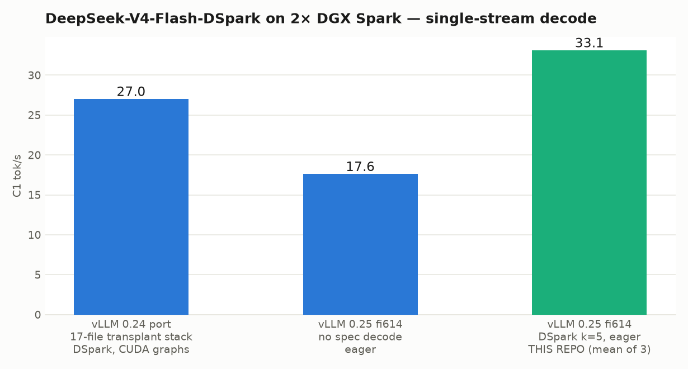
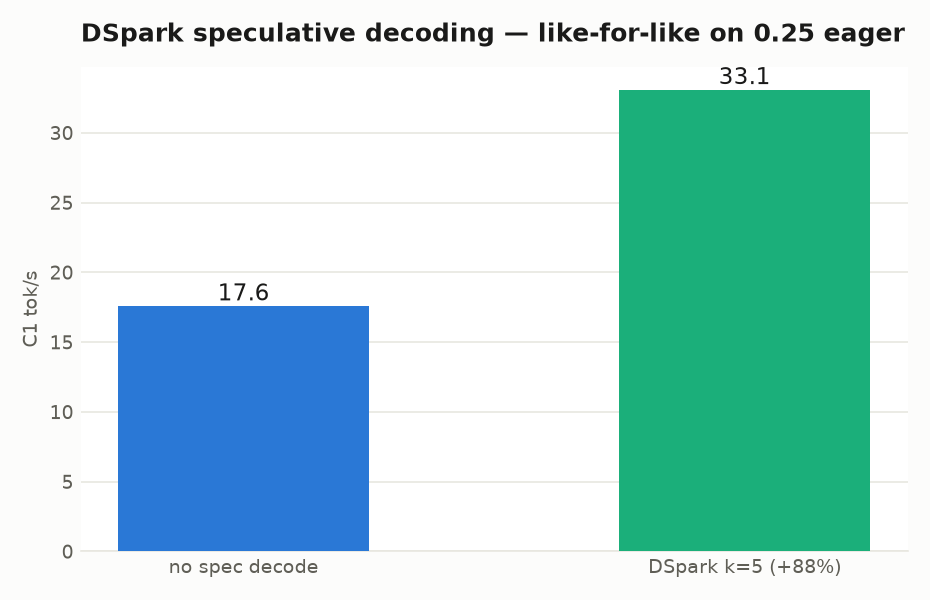
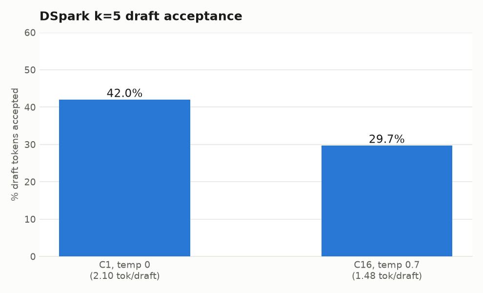
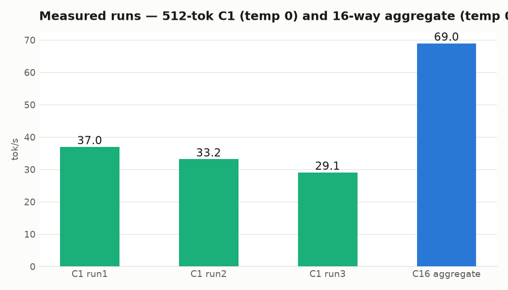

# DeepSeek-V4-Flash-DSpark on 2× DGX Spark — vLLM 0.25 line, 43 tok/s C1 mean (54 peak) with FULL CUDA graphs, 1M context + tool calling

> **2026-07-09 CHAMPION CONFIG — graphs unlocked.** The sm_121a graph-replay wedge (Wall 2)
> turned out to be the **upstream nightly image's GB10 binaries**, not vLLM code: the same vLLM
> generation built GB10-native (`eugr/spark-vllm:latest`, playbook lineage) replays FULL CUDA
> graphs correctly. On that image + two tiny draft-path clamps, graphs + DSpark k=5 run stable:
> **C1 mean 42.9 / peak 54.4 tok/s (12/12 sustained gauntlet), C4 61 / C8 92 / C12 116.5 agg,
> acceptance 55.5%, 3.08M-token KV pool @ 1M ctx.** That is +30% single-stream and +69% @C12
> over the eager stock-nightly numbers below (which remain valid for the stock image).
>
> ```bash
> IMG=eugr/spark-vllm:latest SPEC=dspark EAGER=0 PATCH_DSPARK_EUGR=1 GMU=0.82 SEQS=12 \
>   bash scripts/dsv4-025-serve-r34-mod.sh <rank>   # rank 1 (worker) first
> ```
> `GMU=0.82`, not 0.85: FULL+PIECEWISE capture needs ~3.5 GB headroom on 128 GB unified —
> 0.85 gets the rank SIGKILLed mid-capture. Patches (`patches/eugr-graphs/`): the Wall-1
> width-pad rebased onto eugr's sparse_swa, plus two graph-safety clamps for the sequential
> Markov draft (pad-row ids flow into an embedding gather under replay — clamp them; see
> Wall 2 update). k=7 probe: net loss (40.5 mean, 43% accept). An experimental port of the
> 0.24 stack's confidence-head draft-length scheduler lives in `patches/confidence-experimental/`
> — it raises acceptance to 74-78% but requires `--no-async-scheduling`, which costs more than
> the pruning saves (39.0 mean w/ graphs): educational, not recommended for serving.

Serving recipe and measured benchmarks for **DeepSeek-V4-Flash-DSpark** (157 GB, NVIDIA's
DSpark speculative-decoding release of DSV4-Flash) on **2× NVIDIA DGX Spark (GB10, sm_121a,
128 GB unified each)** at tensor-parallel 2 — on the **upstream vLLM 0.25 line**, where DSpark
is now merged natively ([#46995](https://github.com/vllm-project/vllm/pull/46995),
[#47093](https://github.com/vllm-project/vllm/pull/47093),
[#47429](https://github.com/vllm-project/vllm/pull/47429)).

This retires the entire 0.24-era transplant stack (17-file overlay + hand-swapped flashinfer
`.so` + DeepGEMM transplant) in favor of: **stock nightly image + a 1-line pip bump + one
30-line, provably-safe patch** — and it's faster.



## Measured (2× GB10, TP=2, `--enforce-eager`, DSpark k=5, fp8_ds_mla KV)

| Metric | Value |
|---|---|
| C1 decode (3× 512 tok, temp 0) | **37.0 / 33.2 / 29.1 tok/s (mean ~33)** |
| C1 no-spec baseline (same build) | 17.6 tok/s → **DSpark = +88%** |
| vs 0.24 transplant port (27 C1, graphs on) | **+22% — while running eager** |
| C16 aggregate (16× 256 tok, temp 0.7) | 69.0 tok/s (0.24 port: 77–106 — see graphs note) |
| DSpark acceptance | **42.0%** @ temp 0 (2.10 tok/draft) · 29.7% @ temp 0.7 under batch |
| KV pool | **2,838,963 tokens** @ 256K max ctx, GMU 0.85 |
| KV pool, **1M standing config** | **3,848,951 tokens** @ 1M max ctx, GMU 0.85 (~3.7× full-length seqs) |
| Coherence | ✓ all runs (base model: corpus-style continuations on bare prompts, clean prose in chat-shaped contexts) |





## The two walls (root-caused — read before touching anything)

### Wall 1: warmup crash `Check failed: num_tokens > 64 (5 vs. 64)`

DSpark's non-causal draft pass sizes its SWA sparse-index width as
`cdiv(sliding_window + num_spec_tokens, 128) * 128`. DSV4-Flash has `sliding_window=128`, so
**any** `num_speculative_tokens` in 1..128 yields width **256**. flashinfer 0.6.14's standalone
sm120 decode kernel is an explicit instantiation switch over TOPK ∈ {128, 512, 1024} only
(`sparse_mla_sm120_decode_dsv4.cu` / `_DECODE_DSV4_DISPATCH`); an off-table width silently falls
through to the **prefill** orchestrator, which asserts `num_tokens > 64`. Bisecting
`SPEC_TOKENS` is analytically pointless — every k hits 256.

**Fix** (`patches/sparse_swa.py`, tag `PATCH(gb10-fi614)`): round the non-causal index width up
to the nearest instantiated width (256 → 512). Safe by construction: the Triton fill kernel
already writes `-1` beyond `swa_len` across the full width, and the decode kernel masks via
`topk_length`. (Equivalent upstream fix: add a `DSV4_DISPATCH(32, 256)` instantiation.)

### Wall 2: first sustained request hangs → `RPC call to sample_tokens timed out`

Reproduced with **spec decode fully off**: a 40-token smoke test works, the first 256-token
request wedges the rank-0 worker, and the engine dies at the 300 s RPC timeout. This is the
**CUDA-graphs decode path on sm_121a** (FULL_AND_PIECEWISE mode), not DSpark: `py-spy` shows the
surviving rank idle in `shm_broadcast` dequeue while the wedged rank sits in the full decode
graph replay. `--enforce-eager` eliminates it completely (256/512-tok and `ignore_eos` runs all
pass repeatedly).

**PIECEWISE tested (2026-07-08): also fatal, just slower to die.** `-cc.cudagraph_mode=PIECEWISE`
boots clean (capture succeeds, "Breakable CUDA graph enabled", KV pool 3.99M tokens) and survives
a smoke test plus a few sustained 256/512-token requests — then the engine dumps
`scheduled_spec_decode_tokens=[-1,-1,-1,-1,-1]` (the DSpark draft emitting invalid token ids) and
dies at the same `sample_tokens` RPC timeout. So Wall 2 is not the FULL decode graph specifically:
**any CUDA-graph replay corrupts the upstream DSpark draft path on sm_121a** — FULL wedges on the
first sustained request, PIECEWISE corrupts the draft after a handful. (Same `[-1]` invalid-draft
signature as the Hy3 turboquant×MTP bug on the same silicon — graph/kv-path interactions with
spec-decode draft layers look like a GB10 theme.) `--enforce-eager` remains **mandatory** with
spec decode on. Untested residual: PIECEWISE + `SPEC=none` may hold for graphs-without-spec, but
no-spec eager C1 is 17.6 — you'd need >1.9× from graphs to beat eager+DSpark's 33, so it's not
the route to single-stream wins.

## Step-by-step

### 1. Build the image (one pip bump over stock nightly)

The nightly ships flashinfer 0.6.13, but nightly vLLM's DSV4 sparse-MLA calls the 0.6.14 API
(`swa_topk_lens`, `extra_sparse_indices` — you'll get
`trtllm_batch_decode_sparse_mla_dsv4() got an unexpected keyword argument` on 0.6.13):

```bash
docker build -t vllm-dsv4-025:fi614 image/   # FROM vllm/vllm-openai:nightly-aarch64 + flashinfer 0.6.14
```

Tested against nightly `a23d8ade4ae3` (2026-07-08, vLLM `0.23.1rc1.dev925+g2afa3f7e9`).

### 2. Stage the model on both nodes

`~/models/dsv4-flash-dspark` (157 GB) — the DSpark speculators-format checkpoint. The launcher
bind-mounts it read-only at `/model`.

### 3. Launch (rank 1 on the worker node FIRST, then rank 0 = API node)

```bash
# worker:
IMG=vllm-dsv4-025:fi614 SPEC=dspark EAGER=1 PATCH_SWA=1 bash scripts/dsv4-025-serve-r34-mod.sh 1
# head (API on :8000):
IMG=vllm-dsv4-025:fi614 SPEC=dspark EAGER=1 PATCH_SWA=1 bash scripts/dsv4-025-serve-r34-mod.sh 0
```

### The 1M standing config (measured, verified in production)

Default context is **1M tokens** (`MAXLEN=1048576` — the model's native yarn limit,
`max_position_embeddings: 1048576`). Measured at boot: **KV pool 3,848,951 tokens** @ GMU 0.85 —
a full 1M-token sequence fits ~3.7× over. The serve exposes **OpenAI tool calling**
(`--enable-auto-tool-choice --tool-call-parser deepseek_v4`), verified end-to-end: structured
`tool_calls` come back clean, and a hermes agent gateway drives shell tools through it with
`tool_choice: auto` out of the box.

**Decode speed is unaffected by the 1M reservation** — measured on the live 1M server (C1,
256-tok, temp 0, warm): code **32–37 tok/s**, JSON **~31 tok/s**, prose **~20 tok/s**, DSpark
acceptance 48.5% (k=5). Same acceptance-dependent band as the 256K bench above. First request
on a cold path can be ~5× slower (JIT warmup) — throw one warmup request before measuring.

**Ops rule that bites (both failure modes hit in practice):** launch only on *verified-clean*
nodes. A node with ~75 GB of stale state (page cache + dead NCCL peers) passes weight load and
then dies silently in sparse-MLA warmup (exit 255, no OOM flag). The launcher's 95G-available
guard catches the first case; a container racing you onto the node *between* the guard and the
launch still kills it — re-check `docker ps` if rank0 aborts with a free-memory `ValueError`.

`PATCH_SWA=1` bind-mounts `patches/sparse_swa.py` over
`vllm/v1/attention/backends/mla/sparse_swa.py`. Knobs: `SPEC(dspark|none)`, `SPEC_TOKENS(5)`,
`SEQS(16)`, `MAXLEN(1048576)`, `KVD(fp8_ds_mla)`, `GMU(0.85)`. Adjust `MASTER`/`IF`/`HCA` to your
fabric (ours: 200G RoCE, NCCL IB GID 3).

### 4. Flags that matter

| Flag | Why |
|---|---|
| `--enforce-eager` | **mandatory** — Wall 2; the sm_121a full decode graph wedges the worker |
| `--speculative-config '{"method":"dspark","num_speculative_tokens":5}'` | upstream-native DSpark (forces Model-Runner-V2) |
| `--kv-cache-dtype fp8_ds_mla` | 3.85M-token KV pool at 1M ctx / GMU 0.85 (2.84M @ 256K) |
| `--enable-auto-tool-choice --tool-call-parser deepseek_v4` | OpenAI tool calling, verified with hermes agent gateway |
| `--gpu-memory-utilization 0.85` | house rule for 128 GB unified GB10; higher risks OOM-livelock |
| `--no-enable-prefix-caching` | as benched |
| `--enable-auto-tool-choice --tool-call-parser deepseek_v4` | OpenAI tool calling for agent gateways |

### 5. Operational guardrails (unified-memory Sparks)

- Wait for ≥95 GB `MemAvailable` before launching after any teardown — GB10 reclaims a killed
  serve's pinned memory slowly, and loading 157 GB into a stale reclaim kernel-OOMs the node
  (the launcher enforces this).
- Run a watchdog that `docker kill`s the serve below ~4 GB `MemAvailable`; a kernel OOM here can
  livelock the node past SSH into a physical power cycle.
- Steady state is ~8–9 GB available/node at GMU 0.85 — that's normal, not a leak.

## What the 0.25 migration retired (vs our 0.24 port)

| 0.24-era transplant piece | 0.25 status |
|---|---|
| 17-file DSpark overlay (rafaelcaricio lineage) | upstream (#46995/#47093/#47429) |
| Hand-compiled flashinfer sparse-MLA `.so` swap + nsplit/out_lse fixes | stock `FLASHINFER_MLA_SPARSE_SM120` (pip 0.6.14) |
| DeepGEMM sm_121a transplant | official family-120 support |
| cooperative top-K disable hack | upstream (#47164) |
| Keys concurrency patch | superseded by upstream MRV2 DSpark (verified under C16) |

## Credits

- **[vLLM](https://github.com/vllm-project/vllm)** — upstream DSpark + sparse-MLA sm120 + DeepGEMM-120
- **[flashinfer](https://github.com/flashinfer-ai/flashinfer)** — the sm120 sparse-MLA kernels (0.6.14)
- **DeepSeek** — DSV4-Flash; **NVIDIA** — the DSpark speculative-decoding release
- Prior lineage: [our 0.24 transplant port](https://github.com/drowzeys/keys-vLLm-0.24.0-Optimized-DeepSeekV4-Flash-DSpark-NVFP4-KV-1.5M-CTX-3M-Pool-C-12-on-2-DGX-Spark), aidendle94's compiled-kernel stack
